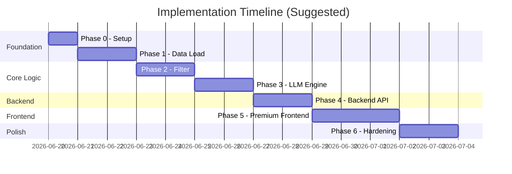
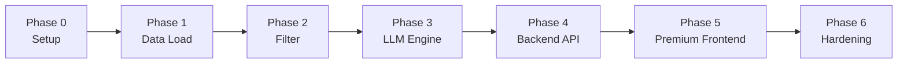

# Implementation Plan: AI-Powered Restaurant Recommendation System

> **Derived from:** [`architecture.md`](./architecture.md) · [`context.md`](./context.md)  
> **Project:** Zomato-inspired restaurant recommendation service with Groq LLM

This document breaks the build into seven sequential phases, with a clear separation between **backend** and **frontend** development. Each phase has clear objectives, tasks, deliverables, and acceptance criteria. Complete phases in order — later phases depend on earlier ones.

---

## Overview

| Phase | Name | Primary Deliverable | Maps to Context Workflow |
|-------|------|---------------------|--------------------------|
| **0** | Project Setup | Runnable skeleton, config, dependencies | — |
| **1** | Data Load | Cached dataset + `RestaurantRepository` | Data Ingestion |
| **2** | Filter & Validate | Deterministic candidate filtering | User Input + Integration (filter) |
| **3** | LLM Engine | Groq-powered rank + explain pipeline | Integration (prompt) + Recommendation Engine |
| **4** | Backend API | FastAPI service exposing recommendation endpoints | Integration (API) |
| **5** | Premium Frontend | High-quality SPA with modern design | Output Display |
| **6** | Hardening | Tests, fallbacks, docs, polish | All success criteria |



---

## Success Criteria Mapping

| # | Success Criterion (context.md) | Completed In |
|---|-------------------------------|--------------|
| 1 | User can specify preferences | Phase 2 (models/validation) + Phase 5 (Frontend UI) |
| 2 | System loads Hugging Face Zomato dataset | Phase 1 |
| 3 | Filtered data passed to LLM with designed prompt | Phase 2 + Phase 3 |
| 4 | Output includes ranked restaurants with all required fields | Phase 3 + Phase 4 (API) |
| 5 | Results presented clearly to end user | Phase 5 (Premium Frontend) |

---

## Phase 0: Project Setup

### Objective

Bootstrap the repository with the module structure, dependencies, configuration, and environment template so all subsequent phases have a consistent foundation.

### Prerequisites

- Python 3.11+
- Git
- Groq API key (needed from Phase 3 onward)

### Tasks

| # | Task | Output |
|---|------|--------|
| 0.1 | Create project directory structure per architecture §5 | `src/`, `tests/`, `data/`, `docs/` |
| 0.2 | Add `requirements.txt` with pinned core deps | `datasets`, `pandas`, `groq`, `pydantic-settings`, `python-dotenv`, `pytest` |
| 0.3 | Add optional deps: `fastapi`, `uvicorn`, `streamlit` | Listed in requirements or `requirements-dev.txt` |
| 0.4 | Create `src/config.py` with `pydantic-settings` `Settings` class | All env vars from architecture §9.1 |
| 0.5 | Create `.env.example` | `GROQ_API_KEY`, `GROQ_MODEL`, `HF_DATASET_NAME`, etc. |
| 0.6 | Add `.gitignore` | Ignore `.env`, `data/*.parquet`, `__pycache__`, `.venv` |
| 0.7 | Create empty model stubs | `restaurant.py`, `preferences.py`, `recommendation.py` |
| 0.8 | Create `src/main.py` entry point (minimal) | Prints version / loads config |
| 0.9 | Initialize `pytest` config (optional `pyproject.toml` or `pytest.ini`) | `tests/` discoverable |

### Files to Create

```
zomato-milestone1/
├── src/
│   ├── __init__.py
│   ├── main.py
│   ├── config.py
│   └── models/
│       ├── __init__.py
│       ├── restaurant.py
│       ├── preferences.py
│       └── recommendation.py
├── tests/
│   └── __init__.py
├── data/                    # empty, gitignored contents
├── .env.example
├── .gitignore
└── requirements.txt
```

### Acceptance Criteria

- [ ] `pip install -r requirements.txt` succeeds in a fresh venv
- [ ] `python -m src.main` runs without error
- [ ] `Settings` loads defaults; missing `GROQ_API_KEY` only fails when LLM is invoked (not at import)
- [ ] `.env.example` documents all configuration variables

### Verification Command

```bash
python -c "from src.config import Settings; print(Settings())"
```

---

## Phase 1: Data Load

### Objective

Load the Hugging Face Zomato dataset, preprocess it into the canonical schema, cache locally, and expose an in-memory `RestaurantRepository` for querying.

**Maps to:** context.md → System Workflow §1 (Data Ingestion)

### Prerequisites

- Phase 0 complete
- Network access to Hugging Face Hub

### Tasks

| # | Task | Details |
|---|------|---------|
| 1.1 | Implement `Restaurant` dataclass | Fields per architecture §3.1 |
| 1.2 | Implement `DatasetLoader` | Load `ManikaSaini/zomato-restaurant-recommendation` via `datasets` |
| 1.3 | Inspect raw columns | Log column names; map to canonical schema (adjust names if dataset differs) |
| 1.4 | Implement `DataPreprocessor` | Parse cuisines, coerce numerics, normalize locations, derive `budget_tier` |
| 1.5 | Tune budget thresholds | Inspect `cost_for_two` distribution; adjust low/medium/high boundaries |
| 1.6 | Implement local cache | Save/load parquet or CSV to `DATA_CACHE_PATH` |
| 1.7 | Implement `RestaurantRepository` | `get_all()`, `get_locations()`, `get_cuisines()`, `get_by_id()` |
| 1.8 | Wire startup in `main.py` | Load or build cache on boot; log record count |
| 1.9 | Write unit tests | `test_preprocessor.py` with fixture rows |

### Preprocessing Checklist

- [ ] Download `train` split (or available default split)
- [ ] Map: name, location, cuisine(s), cost, rating, votes, rest_type
- [ ] Split cuisine strings: `"Italian, Chinese"` → `["Italian", "Chinese"]`
- [ ] Drop rows with invalid/missing name or location
- [ ] Coerce rating to float; handle `"NEW"` or `"-"` ratings if present
- [ ] Assign stable `id` (row index or dataset id)
- [ ] Derive `budget_tier` from configurable thresholds

### Files to Create / Modify

```
src/data/
├── __init__.py
├── loader.py
├── preprocessor.py
└── repository.py
tests/
├── fixtures/
│   └── sample_restaurants.json    # 10–20 frozen rows
└── test_preprocessor.py
data/
└── restaurants.parquet            # generated, gitignored
```

### Acceptance Criteria

- [ ] Dataset loads from Hugging Face on first run
- [ ] Subsequent runs load from local cache (no re-download)
- [ ] `RestaurantRepository.get_all()` returns non-empty list
- [ ] `get_locations()` returns distinct cities (e.g., Delhi, Bangalore)
- [ ] `get_cuisines()` returns flattened unique cuisine list
- [ ] All records conform to canonical schema with valid `budget_tier`
- [ ] Preprocessor unit tests pass

### Verification Commands

```bash
pytest tests/test_preprocessor.py -v
python -c "from src.data.repository import RestaurantRepository; r = RestaurantRepository.load(); print(len(r.get_all()), r.get_locations()[:5])"
```

### Exit Criteria

Phase 1 is done when the repository serves clean restaurant data without any LLM or UI dependency.

---

## Phase 2: Filter & Validate

### Objective

Define user preference models, validate/normalize input, and implement deterministic restaurant filtering to produce a bounded candidate list for the LLM.

**Maps to:** context.md → System Workflow §2 (User Input) + §3 (Integration Layer — filter)

### Prerequisites

- Phase 1 complete (`RestaurantRepository` populated)

### Tasks

| # | Task | Details |
|---|------|---------|
| 2.1 | Implement `UserPreferences` dataclass | Fields per architecture §3.2 |
| 2.2 | Implement `PreferenceValidator` | Required fields, budget enum, rating bounds |
| 2.3 | Implement `PreferenceNormalizer` | Lowercase cuisine, trim text, city alias map |
| 2.4 | Location validation | Reject unknown cities; return suggestions from `get_locations()` |
| 2.5 | Implement `RestaurantFilter` | Sequential filter pipeline per architecture §3.3.1 |
| 2.6 | Implement `CandidateSelector` | Sort by rating desc, votes desc; cap at `MAX_CANDIDATES_FOR_LLM` |
| 2.7 | Implement constraint relaxation | On zero results: relax cuisine → budget → min_rating; attach warning flag |
| 2.8 | Write unit tests | `test_filter.py` with fixture restaurants + preference combos |
| 2.9 | Add CLI smoke script (optional) | Print filtered candidates for manual testing |

### Filter Pipeline (Implement Exactly)

```
all restaurants
  → filter by location
  → filter by budget_tier
  → filter by min_rating
  → filter by cuisine (if provided)
  → sort by (rating DESC, votes DESC)
  → take top N (default 15–20)
```

### Files to Create / Modify

```
src/models/preferences.py          # UserPreferences + validation errors
src/services/
├── __init__.py
└── filter.py                      # RestaurantFilter, CandidateSelector
tests/test_filter.py
```

### Acceptance Criteria

- [ ] Valid preferences pass validation; invalid budget/rating/location raise clear errors
- [ ] Filter returns only restaurants matching location and budget
- [ ] Cuisine filter performs case-insensitive substring match against `restaurant.cuisines`
- [ ] `min_rating` filter excludes lower-rated restaurants
- [ ] Result count never exceeds `MAX_CANDIDATES_FOR_LLM`
- [ ] Zero-result case triggers relaxation and returns a warning message
- [ ] All filter unit tests pass

### Test Cases to Cover

| Scenario | Expected |
|----------|----------|
| Bangalore + medium budget | Subset of Bangalore restaurants in medium tier |
| + cuisine Italian | Further narrowed to Italian-tagged restaurants |
| + min_rating 4.5 | Only high-rated remain |
| Invalid location "Mumbai" (if not in data) | Validation error with suggestions |
| Over-constrained filters | Relaxed results + warning |

### Verification Commands

```bash
pytest tests/test_filter.py -v
```

### Exit Criteria

Phase 2 is done when given any valid `UserPreferences`, the filter returns a deterministic, bounded candidate list from the repository.

---

## Phase 3: LLM Engine

### Objective

Build the Groq integration layer: prompt construction, LLM invocation, JSON parsing, response enrichment, and heuristic fallback.

**Maps to:** context.md → System Workflow §3 (Integration — prompt) + §4 (Recommendation Engine)

### Prerequisites

- Phase 2 complete (filter produces candidates)
- Valid `GROQ_API_KEY` in `.env`

### Tasks

| # | Task | Details |
|---|------|---------|
| 3.1 | Implement `Recommendation` and `RecommendationResponse` models | Per architecture §3.4 |
| 3.2 | Implement `PromptBuilder` | System + user messages; embed preferences + candidate JSON |
| 3.3 | Implement `LLMClient` | Groq SDK wrapper with configurable model/temperature |
| 3.4 | Enable JSON output | `response_format={"type": "json_object"}` where supported |
| 3.5 | Implement `ResponseParser` | Parse and validate LLM JSON schema |
| 3.6 | Implement `RecommendationEnricher` | Join LLM output with repository records by `id` |
| 3.7 | Implement `RecommendationService` | Orchestrate: filter → prompt → LLM → parse → enrich |
| 3.8 | Implement retry logic | Invalid JSON: retry once at temperature 0.1 |
| 3.9 | Implement fallback ranking | On LLM failure/429: top-K by rating with generic explanation |
| 3.10 | Reject hallucinated IDs | Discard recommendations whose `id` is not in candidate set |
| 3.11 | Write tests | Mock `LLMClient`; test parser, enricher, fallback |

### Prompt Requirements

- [ ] System prompt defines role, JSON-only output, no fabrication rule
- [ ] User prompt includes all preference fields including `additional`
- [ ] Candidates serialized with `id`, `name`, `location`, `cuisines`, `cost_for_two`, `rating`
- [ ] Task specifies top K (default 5) with `summary` + `recommendations[]`

### Files to Create / Modify

```
src/services/
├── prompt_builder.py
├── llm_client.py
└── recommendation.py             # RecommendationService + enricher + parser
src/models/recommendation.py
tests/
├── test_recommendation.py
└── fixtures/
    └── mock_llm_response.json
```

### Acceptance Criteria

- [ ] End-to-end call with real Groq API returns valid `RecommendationResponse`
- [ ] Each recommendation includes: name, cuisine, rating, estimated_cost, explanation
- [ ] Factual fields (name, rating, cost) match dataset — not LLM-invented
- [ ] `metadata.candidates_considered` and `metadata.model` populated
- [ ] Invalid JSON triggers one retry, then fallback
- [ ] Groq 429 triggers backoff, then fallback with user-visible note
- [ ] Mocked integration test passes without API call

### Verification Commands

```bash
pytest tests/test_recommendation.py -v
python -c "
from src.services.recommendation import RecommendationService
from src.models.preferences import UserPreferences
svc = RecommendationService()
prefs = UserPreferences(location='Bangalore', budget='medium', cuisine='Italian', min_rating=4.0)
print(svc.recommend(prefs))
"
```

### Exit Criteria

Phase 3 is done when `RecommendationService.recommend(preferences)` returns a complete, enriched response for any valid input — with or without Groq availability (via fallback).

---

## Phase 4: Backend API

### Objective

Build a FastAPI backend service that exposes the recommendation pipeline as a RESTful API with proper request/response schemas, error handling, startup dataset loading, and structured JSON responses.

**Maps to:** context.md → System Workflow §3 (Integration Layer) + architecture §7 (API Design)

### Prerequisites

- Phase 3 complete (`RecommendationService` working)
- `fastapi`, `uvicorn` in `requirements.txt`

### Tasks

| # | Task | Details |
|---|------|---------|
| 4.1 | Create FastAPI application factory | `src/api/main.py` with lifespan event for dataset loading |
| 4.2 | Implement Pydantic request/response schemas | `src/api/schemas.py` — `RecommendRequest`, `RecommendResponse`, `ErrorResponse` |
| 4.3 | Implement `POST /api/v1/recommend` | Accept preferences → validate → filter → LLM → return `RecommendResponse` |
| 4.4 | Implement `GET /api/v1/locations` | Return distinct locations from `RestaurantRepository` |
| 4.5 | Implement `GET /api/v1/cuisines` | Return distinct cuisines from `RestaurantRepository` |
| 4.6 | Implement `GET /api/v1/health` | Return service status, dataset loaded flag, record count |
| 4.7 | Add CORS middleware | Allow frontend origin (localhost dev + production) |
| 4.8 | Add structured error responses | Validation errors return `422` with field-level messages; LLM failures return `503` with fallback data |
| 4.9 | Wire `main.py` entry point | `python -m src.main api` starts uvicorn |
| 4.10 | Write API tests | `tests/test_api.py` using FastAPI `TestClient` with mocked LLM |

### API Endpoints

| Method | Path | Request | Response |
|--------|------|---------|----------|
| `POST` | `/api/v1/recommend` | `{ location, budget, cuisine?, min_rating, additional? }` | `RecommendResponse` with `summary`, `recommendations[]`, `metadata` |
| `GET` | `/api/v1/locations` | — | `{ locations: string[] }` |
| `GET` | `/api/v1/cuisines` | — | `{ cuisines: string[] }` |
| `GET` | `/api/v1/health` | — | `{ status, dataset_loaded, record_count }` |

### Files to Create / Modify

```
src/api/
├── __init__.py
├── main.py                        # FastAPI app factory + lifespan
├── routes.py                      # Route handlers
└── schemas.py                     # Pydantic request/response models
src/main.py                        # Add 'api' mode to entry point
tests/test_api.py                  # TestClient integration tests
```

### Acceptance Criteria

- [ ] `POST /api/v1/recommend` with valid input returns `RecommendResponse` JSON
- [ ] `GET /api/v1/locations` returns all distinct locations
- [ ] `GET /api/v1/cuisines` returns all distinct cuisines
- [ ] `GET /api/v1/health` returns service status with dataset info
- [ ] Invalid request body returns `422` with readable error messages
- [ ] LLM failure triggers fallback and returns results with a `fallback: true` flag
- [ ] CORS headers present for frontend consumption
- [ ] Dataset loads once at startup via lifespan, not per-request
- [ ] All API tests pass with mocked LLM

### Verification Commands

```bash
uvicorn src.api.main:app --reload --port 8000
curl http://localhost:8000/api/v1/health
curl http://localhost:8000/api/v1/locations
curl -X POST http://localhost:8000/api/v1/recommend \
  -H "Content-Type: application/json" \
  -d '{"location":"Bangalore","budget":"medium","min_rating":4.0}'
pytest tests/test_api.py -v
```

### Exit Criteria

Phase 4 is done when the FastAPI backend serves all endpoints, handles errors gracefully, and all API tests pass with mocked LLM.

---

## Phase 5: Premium Frontend Application

### Objective

Build a high-quality, visually stunning Single Page Application (SPA) using HTML, Vanilla CSS, and JavaScript that communicates with the Phase 4 backend API. The frontend must feel **premium and modern** — featuring glassmorphism, smooth animations, responsive layouts, and a polished dark-themed design.

**Maps to:** context.md → System Workflow §2 (User Input) + §5 (Output Display)

### Prerequisites

- Phase 4 complete (Backend API serving all endpoints)

### Design Philosophy

> The user should be **wowed at first glance**. The interface must feel like a premium product — not a basic prototype. Every element should be intentionally styled with cohesive aesthetics, smooth interactions, and visual depth.

### Design Specifications

| Aspect | Specification |
|--------|---------------|
| **Theme** | Dark mode with deep navy/charcoal gradients (`#0a0e1a` → `#1a1f35`) |
| **Accent Color** | Vibrant warm gradient (`#ff6b35` → `#f7c948` gold-orange) |
| **Typography** | Google Fonts — `Inter` for body, `Outfit` for headings |
| **Cards** | Glassmorphism — `backdrop-filter: blur(16px)`, semi-transparent backgrounds, subtle borders |
| **Animations** | CSS transitions (0.3s ease), staggered card entry (`@keyframes fadeSlideUp`), hover lift effects |
| **Layout** | CSS Grid for results, Flexbox for form, fully responsive with mobile breakpoints |
| **Loading State** | Skeleton shimmer animation while awaiting API response |
| **Icons/Badges** | CSS-only rank badges with gradient backgrounds, star ratings with filled/empty states |

### Tasks

| # | Task | Details |
|---|------|---------|
| 5.1 | Create `src/ui/frontend/index.html` | Semantic HTML5 structure with meta tags, Google Fonts link, SEO-friendly |
| 5.2 | Create `src/ui/frontend/css/style.css` | Full design system: CSS custom properties, reset, glassmorphism cards, gradients, animations, responsive grid |
| 5.3 | Create `src/ui/frontend/js/app.js` | Core application logic: fetch API data, populate dropdowns, handle form submission, render results |
| 5.4 | Implement preference form | Location dropdown (populated from `/api/v1/locations`), cuisine dropdown (from `/api/v1/cuisines`), budget radio buttons (styled pill selectors), rating slider with live value label, additional preferences textarea |
| 5.5 | Implement loading states | Full-screen shimmer skeleton cards while API responds; pulsing gradient on submit button |
| 5.6 | Implement results view | Staggered animated result cards with: rank badge (gradient circle), restaurant name, cuisine tags (pill badges), star rating (visual stars), cost display (₹ formatted), AI explanation (italicized callout block) |
| 5.7 | Implement summary banner | Glassmorphic banner above results showing the LLM-generated summary with a subtle icon |
| 5.8 | Implement applied filters display | Pill-style tags above results showing active filters (location, budget, cuisine, rating) |
| 5.9 | Implement error & empty states | Styled error alerts with icon + message for: validation errors, no results found (with broadening suggestions), API unreachable, fallback mode notice |
| 5.10 | Implement responsive design | Mobile-first breakpoints: cards stack vertically below `768px`, form becomes single-column, touch-friendly inputs |
| 5.11 | Mount frontend via FastAPI | `StaticFiles` mount in `src/api/main.py` to serve `src/ui/frontend/` at `/` |
| 5.12 | Add favicon and branding | App title, meta description, themed favicon |

### UI Layout (Wireframe)

```
┌─────────────────────────────────────────────────────────────────┐
│  🍽️  AI Restaurant Recommender              [dark gradient bg]  │
│  ─────────────────────────────────────────────────────────────  │
│                                                                 │
│  ┌─── Glassmorphic Form Card ─────────────────────────────────┐│
│  │  📍 Location    [ Bangalore           ▼ ]                   ││
│  │  💰 Budget      [ ○ Low  ● Medium  ○ High ] (pill style)   ││
│  │  🍕 Cuisine     [ Italian             ▼ ] (optional)       ││
│  │  ⭐ Min Rating  [════════●═══] 4.0                          ││
│  │  📝 Notes       [ family-friendly, outdoor ]                ││
│  │                                                              ││
│  │          [ ✨ Get Recommendations ]  (gradient button)       ││
│  └──────────────────────────────────────────────────────────────┘│
│                                                                 │
│  ┌─── Applied Filters ──────────────────────────────────────┐  │
│  │  📍 Bangalore  ·  💰 Medium  ·  🍕 Italian  ·  ⭐ ≥4.0  │  │
│  └──────────────────────────────────────────────────────────┘  │
│                                                                 │
│  ┌─── AI Summary Banner (glassmorphic) ─────────────────────┐  │
│  │  🤖 "Based on your preferences for Italian cuisine in     │  │
│  │     Bangalore with a medium budget, here are my top..."   │  │
│  └──────────────────────────────────────────────────────────┘  │
│                                                                 │
│  ┌─── Result Cards Grid (2 columns, responsive) ────────────┐  │
│  │                                                            │  │
│  │  ┌──────────────────────┐  ┌──────────────────────┐       │  │
│  │  │ [1] gradient badge   │  │ [2] gradient badge   │       │  │
│  │  │ Example Ristorante   │  │ Pasta Palace         │       │  │
│  │  │ Italian · Continental│  │ Italian              │       │  │
│  │  │ ★★★★½  4.5           │  │ ★★★★☆  4.2           │       │  │
│  │  │ ₹1,200 for two       │  │ ₹900 for two         │       │  │
│  │  │ ┌─ AI Explanation ──┐│  │ ┌─ AI Explanation ──┐│       │  │
│  │  │ │ "Highly rated...  ││  │ │ "Great value...   ││       │  │
│  │  │ └──────────────────┘│  │ └──────────────────┘│       │  │
│  │  └──────────────────────┘  └──────────────────────┘       │  │
│  │                                                            │  │
│  └───────────────────────────────────────────────────────────┘  │
│                                                                 │
│  ─────────────────────────────────────────────────────────────  │
│  Powered by Groq AI · © 2026                                   │
└─────────────────────────────────────────────────────────────────┘
```

### Files to Create / Modify

```
src/ui/
└── frontend/
    ├── index.html                 # Main HTML page
    ├── css/
    │   └── style.css              # Complete design system + components
    ├── js/
    │   └── app.js                 # API integration + DOM rendering
    └── favicon.ico                # App favicon (optional, can be generated)
src/api/main.py                    # Add StaticFiles mount for frontend
```

### CSS Architecture

The stylesheet should be organized as follows:

```
/* 1. CSS Custom Properties (Design Tokens) */
:root { --bg-primary, --bg-card, --accent-gradient, --text-primary, ... }

/* 2. CSS Reset & Base Styles */
*, body, h1-h6, a, button { ... }

/* 3. Typography (Google Fonts) */
@import url('...Inter...Outfit...');

/* 4. Layout Components */
.container, .form-card, .results-grid { ... }

/* 5. Form Elements */
.input-group, .budget-pills, .rating-slider { ... }

/* 6. Result Cards */
.result-card, .rank-badge, .cuisine-tag, .star-rating, .explanation { ... }

/* 7. States */
.loading-skeleton, .error-state, .empty-state, .fallback-notice { ... }

/* 8. Animations */
@keyframes fadeSlideUp, @keyframes shimmer, @keyframes pulse { ... }

/* 9. Responsive Breakpoints */
@media (max-width: 768px) { ... }
@media (max-width: 480px) { ... }
```

### Acceptance Criteria

- [ ] Frontend loads and renders the preference form with all fields populated from API
- [ ] Location dropdown populated dynamically from `/api/v1/locations`
- [ ] Cuisine dropdown populated dynamically from `/api/v1/cuisines`
- [ ] Budget displayed as styled pill selectors (low / medium / high)
- [ ] Rating slider shows live value label
- [ ] Submit button triggers API call with loading skeleton animation
- [ ] Results render as glassmorphic cards with rank badge, name, cuisine tags, star rating, cost, and AI explanation
- [ ] AI summary banner displays above results when present
- [ ] Applied filters shown as pill tags above results
- [ ] Error states display styled alerts (validation, no results, API failure)
- [ ] Fallback mode shows a visible notice when AI explanation is unavailable
- [ ] Responsive layout works on mobile (≤768px) and desktop
- [ ] All interactive elements have hover/focus effects
- [ ] Card entry is staggered with fade-slide animation
- [ ] Page has proper SEO meta tags, title, and heading hierarchy

### Verification Commands

```bash
# Start the full stack (backend serves frontend)
uvicorn src.api.main:app --reload --port 8000
# Open http://localhost:8000 in browser
# Test responsive layout by resizing browser window
```

### Exit Criteria

Phase 5 is done when a non-technical user can open `http://localhost:8000`, enter preferences through a visually stunning interface, and receive beautifully rendered, explainable recommendations. The design should feel premium — not like a prototype.

---

## Phase 6: Hardening

### Objective

Production-readiness for milestone scope: comprehensive tests (backend + frontend integration), error handling polish, logging, documentation, and final validation against all success criteria.

**Maps to:** All context.md success criteria + architecture §9 (cross-cutting concerns)

### Prerequisites

- Phases 1–5 complete

### Tasks

| # | Task | Details |
|---|------|---------|
| 6.1 | Complete test suite | Filter, preprocessor, parser, recommendation (mocked), API endpoints (TestClient) |
| 6.2 | Add prompt snapshot test | Verify prompt contains preferences + all candidates |
| 6.3 | Add frozen fixture dataset | 10–20 rows for deterministic tests |
| 6.4 | Implement structured logging | Filter counts, LLM latency, token usage |
| 6.5 | Ensure no API keys in logs | Redact secrets in log output |
| 6.6 | Harden all error paths | Dataset failure, empty results, LLM failures, unknown location |
| 6.7 | Write `README.md` | Setup, env vars, run instructions (backend + frontend), architecture link |
| 6.8 | Final `.env.example` review | All vars documented with examples |
| 6.9 | Manual QA pass | Test matrix below |
| 6.10 | Frontend cross-browser check | Verify Chrome, Firefox, Edge compatibility |
| 6.11 | (Optional) Dockerfile | Single-container deploy with pre-cached dataset + frontend static files |

### Test Coverage Targets

| Module | Min Tests |
|--------|-----------|
| `preprocessor.py` | Cuisine parsing, numeric coercion, budget tier, location normalize |
| `filter.py` | Each filter stage, sort order, cap, relaxation |
| `prompt_builder.py` | Snapshot: all fields present |
| `response_parser.py` | Valid JSON, malformed JSON, missing fields |
| `recommendation.py` | Mock LLM E2E, fallback path, hallucinated ID rejection |
| `api/routes.py` | All endpoints via TestClient, error responses, CORS |

### Manual QA Matrix

| # | Input | Expected Outcome |
|---|-------|------------------|
| 1 | Bangalore, medium, Italian, 4.0 | ≥1 Italian recommendation with explanation |
| 2 | Delhi, low, no cuisine, 3.5 | Budget-appropriate results |
| 3 | Invalid city | Error + location suggestions (styled alert in frontend) |
| 4 | Very strict filters (no matches) | Relaxed results or empty state with guidance |
| 5 | Disconnect Groq (bad API key) | Fallback ranking with visible notice in UI |
| 6 | Additional: "family-friendly" | Explanations reference family-friendly where relevant |
| 7 | Mobile viewport (≤768px) | All elements readable, cards stack, form single-column |

### Files to Create / Modify

```
tests/
├── test_preprocessor.py           # expand
├── test_filter.py                 # expand
├── test_recommendation.py         # expand
├── test_prompt_builder.py         # new
├── test_api.py                    # expand
└── fixtures/
    ├── sample_restaurants.json
    └── mock_llm_response.json
README.md
.env.example
```

### Acceptance Criteria

- [ ] `pytest` passes with no failures
- [ ] All 5 context.md success criteria verified manually
- [ ] README enables a new developer to run the app in < 15 minutes
- [ ] No secrets committed to git
- [ ] Error messages are user-friendly (styled alerts in frontend, not raw stack traces)
- [ ] Fallback path tested and documented
- [ ] Frontend works on Chrome, Firefox, and Edge

### Verification Commands

```bash
pytest tests/ -v --tb=short
uvicorn src.api.main:app --reload --port 8000   # full manual QA at http://localhost:8000
```

### Exit Criteria

Phase 6 is done when the project is demo-ready: tested, documented, resilient to common failures, and meets all success criteria from `context.md`.

---

## Phase Dependencies



| Phase | Depends On | Blocks |
|-------|------------|--------|
| 0 | — | 1, 2, 3, 4, 5, 6 |
| 1 | 0 | 2, 3, 4, 5 |
| 2 | 1 | 3, 4 |
| 3 | 2 | 4, 5 |
| 4 | 3 | 5, 6 |
| 5 | 4 | 6 |
| 6 | 5 | — |

---

## Configuration Reference

Set these before or during the relevant phase:

| Variable | Phase Needed | Default |
|----------|--------------|---------|
| `HF_DATASET_NAME` | 1 | `ManikaSaini/zomato-restaurant-recommendation` |
| `DATA_CACHE_PATH` | 1 | `./data/restaurants.parquet` |
| `BUDGET_THRESHOLDS_LOW_MAX` | 1 | `500` |
| `BUDGET_THRESHOLDS_MEDIUM_MAX` | 1 | `1500` |
| `MAX_CANDIDATES_FOR_LLM` | 2 | `20` |
| `TOP_K_RECOMMENDATIONS` | 3 | `5` |
| `GROQ_API_KEY` | 3 | — (required) |
| `GROQ_MODEL` | 3 | `llama-3.3-70b-versatile` |
| `GROQ_TEMPERATURE` | 3 | `0.3` |

---

## Risk Register

| Risk | Impact | Mitigation | Phase |
|------|--------|------------|-------|
| Dataset column names differ from expected | Preprocessing breaks | Inspect raw schema in 1.3; adjust mapping | 1 |
| Hugging Face download slow/unavailable | Blocked setup | Local cache + retry with backoff | 1 |
| Budget tiers misaligned with data | Poor filter results | Tune thresholds after distribution analysis | 1 |
| Groq rate limits (429) | Slow/failed recommendations | Exponential backoff + heuristic fallback | 3, 6 |
| LLM returns invalid JSON | Parse failures | Retry at lower temperature + fallback | 3, 6 |
| LLM hallucinates restaurant IDs | Wrong recommendations | Reject IDs not in candidate set | 3 |
| Over-constrained user filters | Empty results | Constraint relaxation + frontend UI guidance | 2, 5 |
| Frontend browser incompatibility | Broken layout/features | Cross-browser testing in Phase 6 | 5, 6 |

---

## Definition of Done (Project Level)

The project is complete when:

1. All seven implementation phases (0–6) acceptance criteria are checked off.
2. All five success criteria from `context.md` are demonstrably met.
3. A user can open `http://localhost:8000`, enter preferences through the premium frontend, and receive ranked restaurants with AI explanations.
4. The system functions (with fallback) even when Groq is temporarily unavailable.
5. `pytest tests/ -v` passes.
6. `README.md` documents setup and usage.
7. The frontend design feels premium — glassmorphism, animations, responsive layout — not a basic prototype.

---

## Related Documents

- [`architecture.md`](./architecture.md) — technical architecture and component design
- [`context.md`](./context.md) — product requirements and workflow
- [`problemStatement.txt`](../problemStatement.txt) — original problem statement
